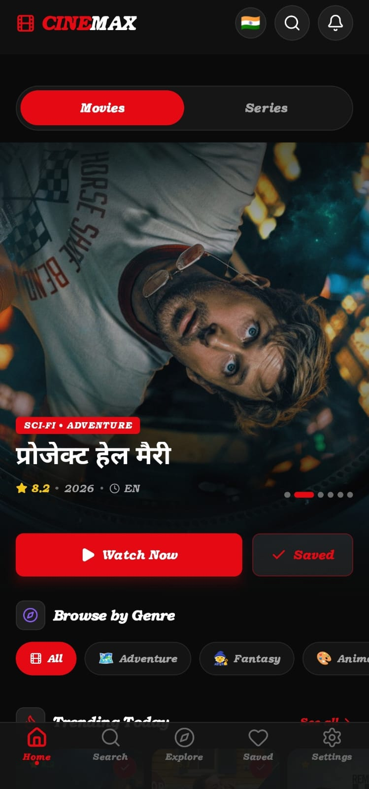
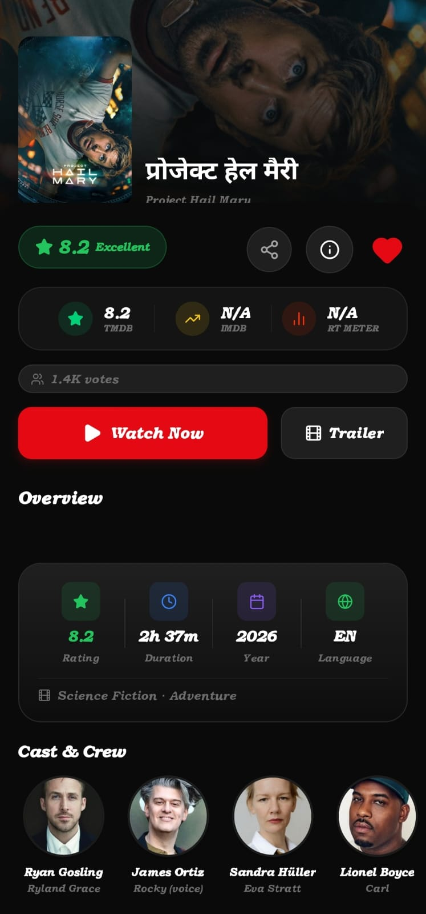
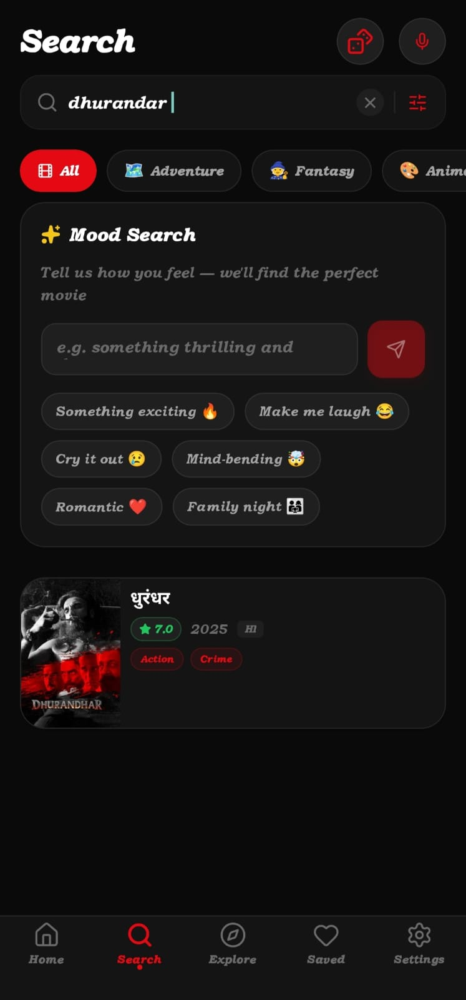
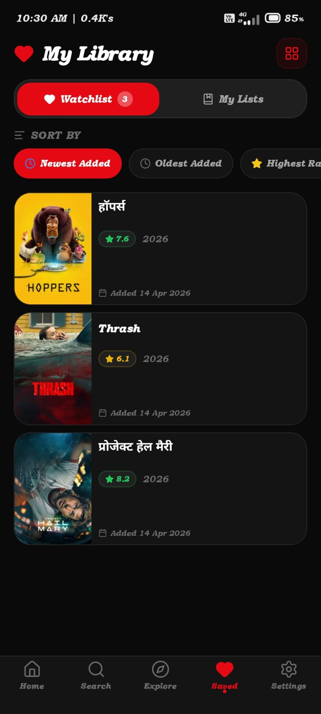
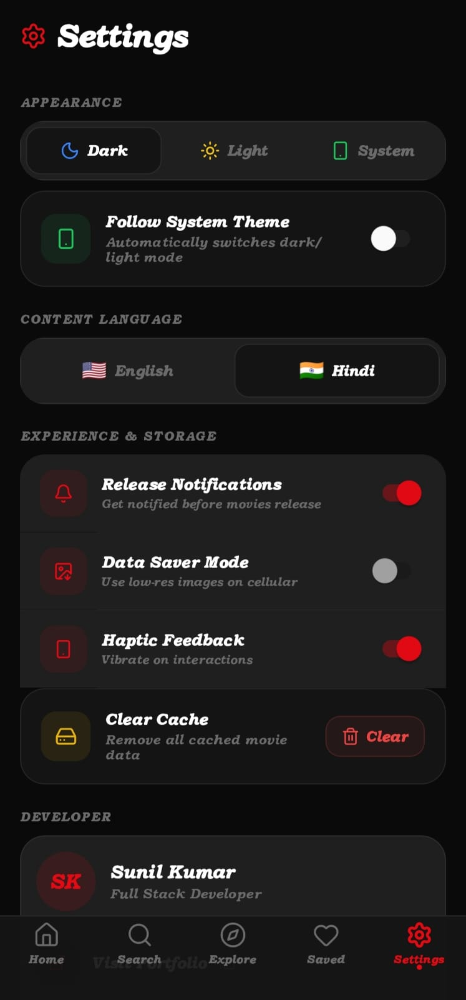

# 🎬 CineMax — The Ultimate Cinema Companion

[](https://expo.dev/)
[](https://reactnative.dev/)
[](https://www.typescriptlang.org/)
[](https://github.com/Sunilkr1/cinemax/releases)

**CineMax** is a high-performance, premium movie discovery application designed for the ultimate entertainment experience. Blazing fast, lightweight, and packed with features that help you find your next favorite movie or TV show.

## 📱 App Showcase

|                         Home                          |                         Details                         |                       Search & AI                       |                        My Library                        |                         Settings                          |
| :---------------------------------------------------: | :-----------------------------------------------------: | :-----------------------------------------------------: | :------------------------------------------------------: | :-------------------------------------------------------: |
|  |  |  |  |  |

---

## ✨ Features

### 🎬 Cinematic Experience

- **Premium Design**: Dark mode by default with glassmorphism and smooth animations.
- **Hero Slider**: Trending featured content at your fingertips.
- **Parallax Details**: Stunning movie pages with trailer integration and cast details.

### 🤖 AI-Powered Search

- **Mood Discovery**: Tell the AI how you feel, and it finds the perfect movie.
- **Voice Search**: Hands-free movie searching.
- **Advanced Filters**: Browse by genre, country, or streaming provider.

### 📦 Portfolio & Customization

- **Developer Section**: Dedicated space in Settings with links to Sunil Kumar's Portfolio and GitHub.
- **Haptic Feedback**: Tactile response on button clicks and interactions.
- **Smart Notifications**: Built-in inbox for updates and release alerts.
- **Custom Lists**: Create and manage your own movie collections.
- **👨‍💻 Premium Splash**: Featuring a custom-coded cinematic "CineMax" reveal on startup.

---

## 🛠️ Tech Stack

- **Core**: React Native & Expo (Managed Workflow)
- **Navigation**: Expo Router (File-based routing)
- **Styling**: NativeWind / Tailwind CSS
- **Data**: TMDB API + React Query for smooth caching
- **Storage**: MMKV / AsyncStorage for extreme speed
- **Animations**: Reanimated & Built-in Animated API

---

## 📥 Installation & Build

If you want to run this project locally:

1. **Clone the Repo**:

   ```bash
   git clone https://github.com/Sunilkr1/cinemax.git
   ```

2. **Install Dependencies**:

   ```bash
   npm install
   ```

3. **Start the Project**:

   ```bash
   npx expo start
   ```

4. **Build your own APK**:
   ```bash
   eas build -p android --profile preview
   ```

---

## 🚀 Download APK

You can download the latest production-ready APK from our **[Releases](https://github.com/Sunilkr1/cinemax/releases)** page.

---

## 👨‍💻 Developed By

**Sunil Kumar**  
Full Stack Developer & Cinema Enthusiast.

- [🌐 My Portfolio](https://portfoliosunilkumar.netlify.app/)
- [🐙 GitHub Profile](https://github.com/Sunilkr1)

---

## ⚖️ License & Credits

- Data provided by [TMDB](https://www.themoviedb.org/).
- Project for personal and portfolio use.

---

_Made with ❤️ by Sunil Kumar._
